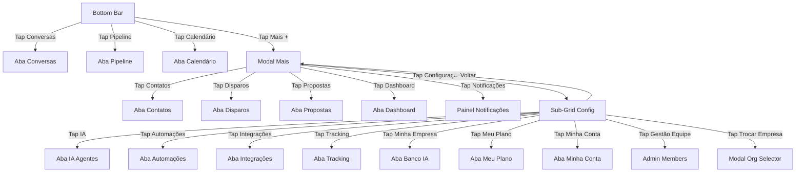

# SolarZap — Blueprint Completo de Adaptação Mobile

> **Data:** 14/03/2026  
> **Escopo:** Adaptar toda a experiência mobile (viewport ≤ 1023px) sem afetar nenhuma funcionalidade desktop  
> **Referência visual:** WhatsApp Business Mobile (aba inferior + modais)  
> **Breakpoint mobile:** `max-width: 1023px` (já utilizado em `SolarZapLayout`)  
> **Breakpoint hook:** `useIsMobile()` em `src/hooks/use-mobile.tsx` (768px — manter para componentes UI internos)

> **Ajuste importante:** para decisões estruturais de layout e navegação, este blueprint passa a considerar **apenas** o breakpoint de `SolarZapLayout` (`max-width: 1023px`). O hook `useIsMobile()` pode continuar existindo para microcomportamentos locais, mas não deve decidir exibição de sidebar, bottom bar ou modal principal, para evitar inconsistência entre 768px e 1023px.

---

## Índice

1. [Resumo Executivo](#1-resumo-executivo)
2. [Princípios de UX/UI](#2-princípios-de-uxui)
3. [Arquitetura de Navegação Mobile](#3-arquitetura-de-navegação-mobile)
4. [Componentes Novos a Criar](#4-componentes-novos-a-criar)
5. [Adaptação por Aba/View — Detalhamento](#5-adaptação-por-abaview--detalhamento)
6. [Modificações em Componentes Existentes](#6-modificações-em-componentes-existentes)
7. [Regras de Convivência Desktop × Mobile](#7-regras-de-convivência-desktop--mobile)
8. [Plano de Execução por Fases](#8-plano-de-execução-por-fases)
9. [Checklist de Qualidade](#9-checklist-de-qualidade)
10. [Riscos e Mitigações](#10-riscos-e-mitigações)
11. [Detalhamento Técnico de Execução](#11-detalhamento-técnico-de-execução)

---

## 1. Resumo Executivo

### Situação Atual
- **Layout:** Sidebar fixa de 60px (`SolarZapNav`) à esquerda + área de conteúdo flex-grow
- **Mobile:** Breakpoint `max-width: 1023px` ativa variável `isMobileViewport` que alterna entre lista de conversas e área de chat — mas **a sidebar de 60px continua visível**, roubando espaço precioso
- **Navegação de abas:** 7 itens no nav principal + ~8 itens no Popover de Configurações
- **Componentes UI:** shadcn/ui (Radix UI + Tailwind) + Drawer (vaul) + Dialog

### Objetivo
Transformar a experiência mobile para funcionar como o WhatsApp Business:
- **Remover** sidebar lateral de 60px no mobile
- **Adicionar** barra de navegação inferior horizontal (Bottom Tab Bar)
- **4 botões fixos:** Conversas, Pipeline, Calendário, Mais (+)
- **Botão "Mais"** abre modal translúcido com acesso a todas as demais abas
- **Botão "Configurações"** dentro do modal "Mais" troca os ícones para a seção de configurações
- **Todas as funcionalidades** permanecem 100% acessíveis e operacionais
- **Zero impacto no desktop** — toda a lógica mobile será gated por `isMobileViewport`

---

## 2. Princípios de UX/UI

### 2.1 Baseados nas Melhores Práticas (Material Design, Apple HIG, WhatsApp Business)

| Princípio | Implementação |
|-----------|--------------|
| **Thumb Zone** | Bottom bar no alcance natural do polegar; itens interativos primários na metade inferior da tela |
| **Touch Targets mínimo 44×44px** | Todos os botões da bottom bar e itens de modal terão no mínimo `h-12 w-12` (48px) |
| **Hierarquia de 3 níveis** | Nível 1: Bottom Bar (4 abas) → Nível 2: Modal "Mais" (todas as abas) → Nível 3: Conteúdo da aba |
| **Minimizar profundidade** | Máximo 1 tap para qualquer aba principal, 2 taps para abas secundárias |
| **Feedback visual imediato** | Aba ativa com indicador visual (ícone filled + gradiente + label) na bottom bar |
| **Não esconder funcionalidades** | Toda funcionalidade acessível no desktop permanece acessível no mobile via modal "Mais" |
| **Motion reduzido** | Respeitar `prefers-reduced-motion`; animações suaves (150-200ms ease-out) |
| **Safe Area** | Respeitar `env(safe-area-inset-bottom)` para notch e barra de gestos (iOS) |
| **Consistência visual** | Usar mesmas variáveis CSS do tema (gradients, cores, radius) do app desktop |
| **Scroll natural** | Cada view ocupa `100dvh - bottom-bar-height` com fallback para `100vh`; scroll interno apenas na área útil, sem scroll da página inteira |
| **Acessibilidade operacional** | Modal fecha por backdrop e `Escape`, trava scroll do fundo e devolve foco ao gatilho |

### 2.2 Padrão WhatsApp Business Adaptado

```
┌────────────────────────────────┐
│         Conteúdo da Aba        │
│                                │
│    (altura: 100vh - 64px)      │
│                                │
│                                │
├────────────────────────────────┤
│  💬        📊       📅     ⊕  │  ← Bottom Tab Bar (h-16 / 64px)
│ Conversas Pipeline Calendário Mais│
└────────────────────────────────┘
     ↑ safe-area-inset-bottom
```

---

## 3. Arquitetura de Navegação Mobile

### 3.1 Bottom Tab Bar — Estrutura

**Guardrail técnico:** a lista de abas mobile não deve ser duplicada manualmente em paralelo ao `SolarZapNav`. O ideal é extrair uma configuração compartilhada de navegação com permissões, labels, ícones e handlers, para desktop e mobile consumirem a mesma fonte de verdade.

**Componente:** `MobileBottomNav.tsx`  
**Posição:** `fixed bottom-0 left-0 right-0 z-40`  
**Altura:** `h-16` (64px) + `pb-[env(safe-area-inset-bottom)]`  
**Fundo:** `bg-background/95 backdrop-blur-xl border-t border-border/50`  

**4 Botões fixos:**

| Posição | ID | Ícone | Label | Comportamento |
|---------|-----|-------|-------|--------------|
| 1 | `conversas` | `MessageCircle` | Conversas | Abre aba Conversas diretamente |
| 2 | `pipelines` | `Kanban` | Pipeline | Abre aba Pipeline diretamente |
| 3 | `calendario` | `Calendar` | Calendário | Abre aba Calendário diretamente |
| 4 | `mais` | `Plus` (dentro de circle) | Mais | Abre modal translúcido |

**Design ativo vs inativo:**
- **Ativo:** Ícone com `brand-gradient-bg` (círculo 40px), texto com `text-primary`, `font-semibold`
- **Inativo:** Ícone `text-muted-foreground/60`, texto `text-muted-foreground text-xs`
- **"Mais" ativo:** Se a aba atual for uma das do modal (contatos, dashboard, etc.), o botão "Mais" aparece com indicador de ativo (dot ou glow)
- **Badge de notificação:** Counter no ícone Conversas (unread) — reaproveitando a lógica existente
- **Notificações:** permanecem como ação/painel, não como aba persistente; no mobile entram no modal "Mais" para não inflar a bottom bar

### 3.2 Modal "Mais" — Estrutura

**Componente:** `MobileMoreModal.tsx`  
**Tipo:** Overlay modal (não Drawer — para cima, não de baixo para cima) translúcido  
**Posição:** `fixed inset-0 z-50`  
**Fundo overlay:** `bg-black/40 backdrop-blur-sm`  
**Container do conteúdo:** `fixed bottom-16 left-0 right-0 z-50` (logo acima da bottom bar)  
**Estilo do container:** `bg-card/97 backdrop-blur-xl border-t border-border/60 rounded-t-2xl shadow-2xl`  
**Animação:** Slide-up 200ms ease-out  

**Comportamentos obrigatórios do modal:**
- Fechar ao tocar no backdrop
- Fechar ao pressionar `Escape`
- Fechar automaticamente ao navegar para uma aba/ação
- Travar o scroll do fundo enquanto estiver aberto
- Restaurar foco para o botão "Mais" ao fechar
- Resetar `showSettings` para `false` a cada reabertura

#### Estado Padrão — Abas Principais

Grid de ícones (2 colunas ou 3 colunas para melhor aproveitamento):

```
┌─────────────────────────────────┐
│          ─── (handle)           │
│                                 │
│  👥 Contatos    📤 Disparos     │
│  📄 Propostas   📊 Dashboard    │
│  🔔 Notificações               │
│                                 │
│  ──────── divisor ────────────  │
│                                 │
│  ⚙️ Configurações →            │  ← Ao tocar, troca para sub-grid
│                                 │
└─────────────────────────────────┘
```

Cada item é um `button` com:
- `w-full flex flex-col items-center gap-1.5 py-3 px-2 rounded-xl`
- Ícone dentro de container `w-12 h-12 rounded-xl bg-primary/10 flex items-center justify-center`
- Label `text-xs font-medium text-foreground`
- Touch target: mínimo 48px

#### Estado "Configurações" — Sub-Abas

Ao tocar em "Configurações", o conteúdo do modal faz crossfade para:

```
┌─────────────────────────────────┐
│  ← Voltar       Configurações   │
│                                 │
│  🤖 Inteligência Artificial     │
│  ⚡ Automações                  │
│  🔗 Central de Integrações      │
│  📍 Tracking e Conversões       │
│  🏢 Minha Empresa               │
│                                 │
│  ──────── divisor ────────────  │
│                                 │
│  💳 Meu Plano (admin only)      │
│  👤 Minha Conta                  │
│  👥 Gestão de Equipe (admin)     │
│  🔄 Trocar Empresa (se multi)   │
│                                 │
└─────────────────────────────────┘
```

**Botão "Voltar":** Retorna ao estado padrão do modal  
**Permissões:** Respeita `tabPermissions` e `canAccessAdmin` — mesma lógica do `SolarZapNav`

### 3.3 Fluxo de Interação



---

## 4. Componentes Novos a Criar

### 4.1 `src/components/solarzap/MobileBottomNav.tsx`

```
Props:
  - activeTab: ActiveTab
  - onTabChange: (tab: ActiveTab) => void
  - onMorePress: () => void
  - unreadCount?: number
  - isMoreActive: boolean  // true se aba atual é uma "secundária"

Renderiza:
  - Container fixed bottom-0 com 4 botões
  - Ícone ativo com gradient bg (reutiliza brand-gradient-bg)
  - Badge de unread no Conversas
  - Botão "Mais" com ícone Plus em círculo
  - Safe area padding inferior
```

### 4.2 `src/components/solarzap/MobileMoreModal.tsx`

```
Props:
  - isOpen: boolean
  - onClose: () => void
  - activeTab: ActiveTab
  - onTabChange: (tab: ActiveTab) => void
  - onNotificationsClick: () => void
  - unreadNotifications: number
  - tabPermissions: { ... }       // mesmo tipo do SolarZapNav
  - isAdminUser: boolean
  - onAdminMembersClick: () => void
  - hasMultipleOrganizations: boolean
  - onSwitchOrganization: () => void
  - activeOrganizationName?: string
  - onHelpClick?: () => void

State interno:
  - showSettings: boolean (toggle entre grid principal e sub-grid configurações)

Renderiza:
  - Overlay bg-black/40 backdrop-blur-sm (tap para fechar)
  - Container com grid de ícones
  - Animação slide-up
  - Crossfade entre estado "Mais" e "Configurações"
```

### 4.3 `src/hooks/useMobileViewport.ts` (opcional — refactor)

```
Centralizar a detecção mobile que hoje está inline no SolarZapLayout:
  - Breakpoint: 1023px (manter o existente)
  - Retorna { isMobileViewport: boolean }
  - Usado por SolarZapLayout + MobileBottomNav + qualquer view que precise
```

> **Nota:** Pode-se optar por continuar usando o state `isMobileViewport` diretamente no Layout e passar como prop. Avaliar na implementação.

### 4.4 `src/components/solarzap/mobileNavConfig.ts` (recomendado)

```
Objetivo:
  - Extrair a configuração de navegação hoje distribuída entre `SolarZapNav` e a navegação mobile
  - Evitar divergência futura entre labels, ícones, permissões e handlers

Conteúdo sugerido:
  - mainTabs: conversas, pipelines, calendario
  - secondaryTabs: contatos, disparos, propostas, dashboard
  - settingsTabs: ia_agentes, automacoes, integracoes, tracking, banco_ia, minha_conta, meu_plano
  - actionItems: notifications, admin_members, switch_org, help

Benefício:
  - Desktop e mobile passam a consumir a mesma fonte de verdade
  - Reduz risco de esquecer permissões ou inconsistir com `SolarZapNav`
```

---

## 5. Adaptação por Aba/View — Detalhamento

### 5.1 Conversas (ConversationList + ChatArea)

**Layout atual mobile:** ConversationList full-width OU ChatArea full-width (toggle via `selectedConversation`)  
**Funciona bem** — é o padrão WhatsApp Business nativo.

**Ajustes necessários:**

| Item | Mudança | Detalhes |
|------|---------|---------|
| **Altura do container** | Adicionar `pb-16` (ou `mb-16`) | Impedir que a lista de conversas e o chat fiquem atrás da bottom bar |
| **Área de chat input** | Verificar sobreposição com bottom bar | Input bar do chat deve ficar **acima** da bottom bar; quando chat está ativo, bottom bar pode ficar oculta ou semitransparente |
| **Botão FAB "+"** | Reposicionar para `bottom-20 right-4` | Subir o FAB de criar lead para acima da bottom bar |
| **Back button** | Já existe (`onBack` prop, `md:hidden`) | Manter — funciona corretamente |
| **Details Panel** | Já usa `absolute inset-0 z-30` no mobile | Manter — funciona como overlay full-screen |
| **Resize handle** | Já oculto no mobile (`!isMobileViewport &&`) | OK, sem mudança |

**Decisão de UX para chat ativo:**
Quando o usuário está dentro de uma conversa (ChatArea visível), a bottom bar deve:
- **Opção recomendada:** Ocultar a bottom bar enquanto o chat está ativo para maximizar a area de conteúdo (similar ao WhatsApp Business que esconde tabs quando abre a conversa)
- O back button do ChatArea volta para a lista de conversas e a bottom bar reaparece
- Ao ocultar a bottom bar, o padding inferior do layout deve ser removido dinamicamente para não sobrar uma faixa vazia no rodapé

```
Estado: Lista de conversas
┌────────────────────────────────┐
│  🔍 Buscar conversas...        │
│  ───────────────────────────── │
│  João Silva              14:02 │
│  Maria Santos            13:37 │
│  ...                           │
│  [+] (FAB criar lead)         │
├────────────────────────────────┤
│  💬      📊      📅      ⊕   │
└────────────────────────────────┘

Estado: Chat aberto
┌────────────────────────────────┐
│ ← João Silva        📞 ℹ️     │
│  ───────────────────────────── │
│  [mensagens]                   │
│                                │
│  [input bar + mic + attach]    │
└────────────────────────────────┘
(bottom bar escondida)
```

### 5.2 Pipeline (PipelineView)

**Layout atual:** Kanban horizontal com drag-to-scroll com múltiplas colunas  
**Problema mobile:** Colunas kanban ficam apertadas; difícil manipular cards

**Ajustes necessários:**

| Item | Mudança | Detalhes |
|------|---------|---------|
| **Scroll horizontal** | Manter scroll horizontal nativo com snap | Cada coluna ocupa ~85vw com CSS `scroll-snap-type: x mandatory` e `scroll-snap-align: center` |
| **Largura das colunas** | No mobile: `min-w-[85vw]` ao invés de largura fixa | Cada coluna quase full-width — swipe entre colunas |
| **Indicador de coluna** | Adicionar dots indicator ou nome da coluna fixa no topo | Mostrar qual estágio está visível: "Novo Lead (3)" com setas ← → |
| **Cards de lead** | Já parecem ser adequados (width auto) | Verificar touch targets — botões de ação devem ter min 44px |
| **Drag-and-drop** | Desabilitar drag no mobile; usar botão "Mover" | Touch DnD é problemático; usar dropdown/sheet "Mover para estágio" |
| **Header toolbar** | Stack verticalmente filtros/ações | Filtros em row scrollable horizontal ou collapse em menu |
| **Botão FAB "+"** | Reposicionar `bottom-20` | Subir acima da bottom bar |
| **Container height** | `h-[calc(100vh-64px)]` | Descontar bottom bar |

### 5.3 Calendário (CalendarView)

**Layout atual:** Calendário principal + sidebar fixa `w-96` à direita  
**Problema mobile:** Sidebar de 384px impossível em 375px de largura

**Ajustes necessários:**

| Item | Mudança | Detalhes |
|------|---------|---------|
| **Sidebar de eventos** | No mobile: transformar em Sheet/Drawer bottom | Ao tocar em um dia do calendário, abrir drawer com eventos daquele dia |
| **Calendário principal** | Full-width no mobile | Remover sidebar; calendário ocupa 100% |
| **View switching** | Manter tabs (Mês/Semana/Dia) | Tabs horizontais no topo — já funcionam em qualquer largura |
| **Criar evento** | FAB "+" posicionado `bottom-20 right-4` | Subir acima da bottom bar |
| **Container** | `pb-16` para dar espaço à bottom bar | Evitar sobreposição |
| **Eventos upcoming/past** | Acessíveis via botão "Ver eventos" ou swipe-up drawer | Não eliminar — mover para sheet acessível |

### 5.4 Contatos (ContactsView)

**Layout atual:** Tabela de dados com colunas  
**Problema mobile:** Tabelas não funcionam em 375px

**Ajustes necessários:**

| Item | Mudança | Detalhes |
|------|---------|---------|
| **Layout mobile** | Card list ao invés de tabela | Cada contato é um card compacto: avatar + nome + telefone + stage badge |
| **Filtros** | Horizontal scrollable pills ou bottom drawer | Filtros em pills row no topo |
| **Ações por contato** | Long-press ou swipe-to-reveal | Ou tap no card abre sheet com ações (editar, ligar, mover, deletar) |
| **Busca** | Sticky search bar no topo | Mesmo comportamento, full-width |
| **Import/Export** | Mover para menu "⋮" no header | Dropdown no header da view |
| **Botão FAB "+"** | `bottom-20 right-4` | Criar lead |
| **Container** | `pb-16` | Bottom bar |

### 5.5 Disparos (BroadcastView)

**Layout atual:** Grid `grid-cols-1 lg:grid-cols-2` com cards de campanha + stats  
**Status:** Já parcialmente responsivo!

**Ajustes necessários:**

| Item | Mudança | Detalhes |
|------|---------|---------|
| **Grid** | Já é `grid-cols-1` no mobile — OK | Sem mudança no grid |
| **Stats no card-header** | Verificar que não overflow | Stack vertical se necessário |
| **Wizard de criar broadcast** | Verificar dialogs/modais em tela pequena | Garantir que o wizard step-by-step use full-width no mobile |
| **Container** | `pb-16` | Bottom bar space |

### 5.6 Propostas (ProposalsView)

**Layout atual:** Tabela + filtros  
**Problema:** Tabela overflow no mobile

**Ajustes necessários:**

| Item | Mudança | Detalhes |
|------|---------|---------|
| **Tabela → Cards** | No mobile: renderizar como lista de cards | Card: nome do lead + valor + status badge + data |
| **Filtros** | Pills horizontais scrollable | Ou dropdown compacto |
| **Ações** | Tap no card abre sheet com opções | Enviar, editar, duplicar, deletar |
| **Container** | `pb-16` | Bottom bar |
| **Gerar proposta modal** | Verificar full-width | Garantir `max-w-[calc(100vw-2rem)]` |

### 5.7 Dashboard (DashboardView)

**Layout atual:** Scroll vertical com KPI cards + charts + tabelas  
**Status:** Parcialmente responsivo

**Ajustes necessários:**

| Item | Mudança | Detalhes |
|------|---------|---------|
| **KPI cards grid** | `grid-cols-2` no mobile (ao invés de 3-4) | Cards menores e empilhados em 2 colunas |
| **Gráficos** | Full-width com scroll horizontal se necessário | Gráficos `recharts` respondem a container width |
| **Período/filtros** | Dropdown compacto ao invés de tabs largas | Ou horizontal scroll |
| **Tabelas de ranking** | Card list ou tabela com scroll horizontal | Scroll-x com sticky first column |
| **Container** | `pb-16` | Bottom bar |

### 5.8 IA Agentes (AIAgentsView)

**Layout atual:** Grid `grid-cols-1 md:grid-cols-2`  
**Status:** Já responsivo!

**Ajustes necessários:**

| Item | Mudança | Detalhes |
|------|---------|---------|
| **Grid** | Já `grid-cols-1` no mobile — OK | Sem mudança |
| **Header tabs/filtros** | Verificar overflow | Stack se necessário |
| **Config panel** | Full-width no mobile | Garantir formulários 100% largura |
| **Container** | `pb-16` | Bottom bar |

### 5.9 Automações (AutomationsView)

**Layout atual:** ScrollArea com cards empilhados verticalmente  
**Status:** Naturalmente responsivo  

**Ajustes necessários:**

| Item | Mudança | Detalhes |
|------|---------|---------|
| **Cards** | Já full-width — OK | Verificar toggle switch touch targets (min 44px) |
| **Container** | `pb-16` | Bottom bar |
| **Configurações inline** | Verificar que inputs não ficam atrás do teclado virtual | `scrollIntoView` no focus do input |

### 5.10 Knowledge Base / Minha Empresa (KnowledgeBaseView)

**Layout atual:** Tabs + conteúdo scrollable  
**Status:** Adequado

**Ajustes necessários:**

| Item | Mudança | Detalhes |
|------|---------|---------|
| **Tabs** | Horizontal scroll se muitas tabs | `overflow-x-auto whitespace-nowrap` no container de tabs |
| **Upload area** | Full-width | Garantir drop-zone responsiva |
| **Container** | `pb-16` | Bottom bar |

### 5.11 Integrações (IntegrationsView)

**Layout atual:** Cards de integrações  
**Status:** Parcialmente responsivo

**Ajustes necessários:**

| Item | Mudança | Detalhes |
|------|---------|---------|
| **QR Code display** | Centralizar, max-width 280px | QR legível no mobile |
| **Instance cards** | Full-width stacked | Cards 100% largura |
| **Container** | `pb-16` | Bottom bar |

### 5.12 Tracking (TrackingView)

**Layout atual:** Tabs + tabelas  
**Problema:** Tabelas overflow

**Ajustes necessários:**

| Item | Mudança | Detalhes |
|------|---------|---------|
| **Tabelas** | Scroll horizontal com sticky first column | Ou card view para items |
| **Configuração de pixel** | Inputs full-width | Formulários responsivos |
| **Container** | `pb-16` | Bottom bar |

### 5.13 Configurações de Conta (ConfiguracoesContaView)

**Layout atual:** Formulário vertical  
**Status:** Naturalmente responsivo

**Ajustes necessários:**

| Item | Mudança | Detalhes |
|------|---------|---------|
| **Avatar upload** | Centralizar, touch-friendly | Área de toque ampla |
| **Formulários** | Já full-width | Verificar padding e margin |
| **Container** | `pb-16` e `overflow-y-auto` | Bottom bar + scroll |

### 5.14 Meu Plano (MeuPlanoView)

**Layout atual:** Cards de plano + usage bars  
**Status:** Adequado

**Ajustes necessários:**

| Item | Mudança | Detalhes |
|------|---------|---------|
| **Plan cards** | Stack vertical no mobile | 1 coluna |
| **Usage bars** | Full-width | OK naturalmente |
| **Container** | `pb-16` | Bottom bar |

### 5.15 Admin Members (AdminMembersPage)

**Layout atual:** Tabela de membros  
**Problema:** Tabela pode overflow

**Ajustes necessários:**

| Item | Mudança | Detalhes |
|------|---------|---------|
| **Tabela → Cards** | Lista de cards: avatar + nome + role badge + ações | Similar a contacts |
| **Invite modal** | Full-width | Verificar responsividade |
| **Container** | `pb-16` | Bottom bar |

---

## 6. Modificações em Componentes Existentes

### 6.1 `SolarZapLayout.tsx` — Alterações

```
ANTES:
  <div className="app-shell-bg h-screen w-full flex bg-background overflow-hidden">
    <SolarZapNav ... />        ← sempre visível
    {/* content area */}
  </div>

DEPOIS:
  <div className="app-shell-bg h-screen w-full flex bg-background overflow-hidden">
    {!isMobileViewport && <SolarZapNav ... />}   ← esconder no mobile
    
    <div className={cn(
      "flex-1 flex flex-col min-w-0 min-h-0 overflow-hidden",
      showMobileBottomBar && "pb-16"
    )}>
      {/* content area — todas as tabs */}
    </div>
    
    {showMobileBottomBar && (
      <>
        <MobileBottomNav
          activeTab={activeTab}
          onTabChange={handleTabChange}
          onMorePress={() => setIsMobileMoreOpen(true)}
          unreadCount={unreadNotifications}
          isMoreActive={!['conversas','pipelines','calendario'].includes(activeTab)}
        />
        <MobileMoreModal
          isOpen={isMobileMoreOpen}
          onClose={() => setIsMobileMoreOpen(false)}
          activeTab={activeTab}
          onTabChange={(tab) => { handleTabChange(tab); setIsMobileMoreOpen(false); }}
          onNotificationsClick={() => { setIsNotificationsPanelOpen(true); setIsMobileMoreOpen(false); }}
          unreadNotifications={unreadNotifications}
          tabPermissions={...}
          isAdminUser={canAccessAdmin}
          onAdminMembersClick={() => { navigate('/settings/members'); setIsMobileMoreOpen(false); }}
          hasMultipleOrganizations={hasMultipleOrganizations}
          onSwitchOrganization={() => { setIsOrganizationSwitcherOpen(true); setIsMobileMoreOpen(false); }}
          activeOrganizationName={activeOrganizationName}
          onHelpClick={() => { guidedTour.startTour('manual'); setIsMobileMoreOpen(false); }}
        />
      </>
    )}
  </div>
```

**Novos states:**
```ts
const [isMobileMoreOpen, setIsMobileMoreOpen] = useState(false);
```

**Ajuste de visibilidade da bottom bar durante chat:**
```ts
// Quando está na aba conversas E tem uma conversa ativa no mobile, esconder a bottom bar
const showMobileBottomBar = isMobileViewport && !(activeTab === 'conversas' && activeConversation);
```

**Ajuste de sincronização e fechamento automático:**
```ts
useEffect(() => {
  if (!showMobileBottomBar) {
    setIsMobileMoreOpen(false);
  }
}, [showMobileBottomBar]);

useEffect(() => {
  setIsMobileMoreOpen(false);
}, [activeTab, location.pathname]);
```

**Exceção de rota importante:**
- `admin_members` já depende de `location.pathname === '/settings/members'`
- O fluxo mobile não deve quebrar esse comportamento
- Abas internas continuam state-driven; exceções já roteadas permanecem route-driven

### 6.2 `SolarZapNav.tsx` — Sem Alteração

O componente não precisa ser modificado. Ele será simplesmente desmontado no mobile via `{!isMobileViewport && <SolarZapNav />}`.

### 6.3 `BillingBanner` — Ajuste de posicionamento

```
ANTES: className="absolute top-0 left-[60px] right-0 z-20 ..."
DEPOIS: className={cn("absolute top-0 right-0 z-20", isMobileViewport ? "left-0" : "left-[60px]")}
```

### 6.4 `ReadOnly Banner` — Ajuste de posicionamento

Mesmo padrão: no mobile, não há offset de 60px.

### 6.5 Cada View — Paddings de Bottom Bar

Aplicar `pb-16` (via wrapper no Layout) apenas quando `showMobileBottomBar === true`, para evitar conteúdo atrás da bottom bar sem deixar espaço morto quando a barra estiver oculta. O ideal é centralizar isso no wrapper do Layout com `min-h-0 overflow-hidden`, evitando scroll duplo.

### 6.6 FABs (Floating Action Buttons) — Reposicionar

Todos os FABs "+" presentes nas abas Conversas, Pipeline e Contatos:
```
ANTES: className="absolute bottom-4 right-4 ..."
DEPOIS: className={cn("absolute right-4", isMobileViewport ? "bottom-20" : "bottom-4")} 
```

Alternativa: Passar `isMobileViewport` como prop e ajustar internamente.  
**Ajuste recomendado:** não depender apenas de padding do wrapper para reposicionar FAB absoluto. Como os FABs usam `absolute bottom-4`, o mais seguro é aplicar offset explícito por viewport (`bottom-20` no mobile, `bottom-4` no desktop) ou usar uma CSS custom property compartilhada como `--mobile-bottom-offset`.

**Motivo:** padding no wrapper melhora a área útil, mas não altera automaticamente a âncora visual de um elemento absoluto preso ao rodapé do container.

---

## 7. Regras de Convivência Desktop × Mobile

### 7.1 Princípio Fundamental
> **Todo código mobile DEVE ser gated por `isMobileViewport`** — nenhuma classe, componente ou lógica mobile pode afetar viewports ≥ 1024px.

### 7.2 Estratégias de Isolamento

| Cenário | Estratégia |
|---------|-----------|
| **Componentes exclusivos mobile** | Renderização condicional: `{isMobileViewport && <MobileBottomNav />}` |
| **Componentes exclusivos desktop** | Renderização condicional: `{!isMobileViewport && <SolarZapNav />}` |
| **Classes CSS condicionais** | Usar `cn()`: `cn("base-class", isMobileViewport && "mobile-specific")` |
| **Props condicionais** | Passar `isMobileViewport` como prop quando a view precisa de layout diferente |
| **Tailwind responsive** | Usar classes como `lg:flex` (aparece ≥1024px) e ausência implica mobile — **PORÉM** preferir lógica JS explícita para mudanças estruturais grandes |

### 7.3 O que NÃO Fazer

- ❌ Alterar classes CSS incondicionais que afetem desktop
- ❌ Mover componentes que afetem o z-index stack do desktop
- ❌ Remover props ou callbacks existentes de componentes
- ❌ Alterar lógica de negócios (filtros, queries, mutations) baseado em viewport
- ❌ Criar media queries em CSS global que afetem desktop acidentalmente
- ❌ Usar `display: none` ou `hidden` sem media query — sempre gate com JS
- ❌ Duplicar listas de tabs, permissões e labels entre `SolarZapNav` e componentes mobile

---

## 8. Plano de Execução por Fases

### FASE 1 — Infraestrutura de Navegação (Prioridade Crítica)
**Objetivo:** Bottom bar + Modal "Mais" funcionando; sidebar escondida no mobile  
**Risco:** Baixo — componentes novos, sem tocar nos existentes (exceto Layout wrapper)

| # | Tarefa | Arquivo(s) | Estimativa |
|---|--------|-----------|-----------|
| 1.1 | Criar `MobileBottomNav.tsx` | `src/components/solarzap/MobileBottomNav.tsx` | Novo componente |
| 1.2 | Criar `MobileMoreModal.tsx` | `src/components/solarzap/MobileMoreModal.tsx` | Novo componente |
| 1.2.1 | Extrair `mobileNavConfig.ts` compartilhado | `src/components/solarzap/mobileNavConfig.ts` | Novo arquivo de suporte |
| 1.3 | Integrar no `SolarZapLayout.tsx` | Esconder SolarZapNav no mobile, renderizar BottomNav + MoreModal, ajustar state | Modificação |
| 1.4 | Ajustar `BillingBanner` posicionamento | `SolarZapLayout.tsx` (inline) | 1 linha |
| 1.5 | Ajustar `ReadOnly Banner` posicionamento | `SolarZapLayout.tsx` (inline) | 1 linha |
| 1.6 | Teste visual: verificar todas as abas acessíveis via bottom bar + modal | Manual + E2E | Teste |
| 1.7 | Ocultar bottom bar quando ChatArea está ativo | `SolarZapLayout.tsx` | 2 linhas de lógica |

**Critério de aceite Fase 1:**
- ✅ Desktop: zero diferenças visuais
- ✅ Mobile: sidebar escondida, bottom bar visível com 4 botões
- ✅ Tap "Mais" abre modal com todas as abas
- ✅ "Configurações" no modal mostra sub-abas
- ✅ Cada aba do modal navega corretamente
- ✅ Bottom bar esconde quando chat aberto
- ✅ Badge de notificação funciona
- ✅ Permissões, labels e visibilidade de tabs batem com o desktop

### FASE 2 — Conversas Mobile (Prioridade Alta)
**Objetivo:** Experiência de chat idêntica ao WhatsApp Business

| # | Tarefa | Arquivo(s) |
|---|--------|-----------|
| 2.1 | Ajustar altura do container de conversas (padding inferior) | Layout wrapper |
| 2.2 | Reposicionar FAB "+" de criar lead acima da bottom bar | `SolarZapLayout.tsx` |
| 2.3 | Verificar input bar do chat não sobrepõe bottom bar | `ChatArea.tsx` — testar, provável OK pois bottom bar fica oculta |
| 2.4 | Testar back button, details panel overlay, message reactions | Teste manual |

**Critério de aceite:**
- ✅ Lista de conversas scroll completo sem obstrução
- ✅ FAB visível e acessível
- ✅ Chat abre full-screen sem bottom bar
- ✅ Back button retorna para lista + bottom bar reaparece

### FASE 3 — Pipeline Mobile (Prioridade Alta)
**Objetivo:** Kanban navegável por swipe com colunas full-width

| # | Tarefa | Arquivo(s) |
|---|--------|-----------|
| 3.1 | Detectar mobile e aplicar `min-w-[85vw]` + `scroll-snap` nas colunas | `PipelineView.tsx` |
| 3.2 | Adicionar indicador de estágio atual (dots ou header fixo com nome) | `PipelineView.tsx` |
| 3.3 | Substituir drag-and-drop por bottom sheet "Mover para estágio" no mobile | `PipelineView.tsx` / novo `MoveStageSheet.tsx` |
| 3.4 | Ajustar header/toolbar para mobile (filtros em scroll horizontal) | `PipelineView.tsx` |
| 3.5 | Reposicionar FAB "+" | Layout wrapper |

### FASE 4 — Calendário Mobile (Prioridade Alta)
**Objetivo:** Calendário full-width com eventos em drawer

| # | Tarefa | Arquivo(s) |
|---|--------|-----------|
| 4.1 | Esconder sidebar de eventos no mobile | `CalendarView.tsx` |
| 4.2 | Adicionar botão "Ver eventos" ou indicador que abre Drawer | `CalendarView.tsx` |
| 4.3 | Criar Drawer/Sheet de eventos do dia selecionado | Reutilizar `Drawer` de shadcn/ui |
| 4.4 | Verificar calendário react-day-picker responsivo | Teste |
| 4.5 | Ajustar FAB e bottom padding | Layout wrapper |

### FASE 5 — Contatos Mobile (Prioridade Média)
**Objetivo:** Lista de cards ao invés de tabela

| # | Tarefa | Arquivo(s) |
|---|--------|-----------|
| 5.1 | Criar componente `ContactCard` para exibição mobile | `ContactsView.tsx` (interno) |
| 5.2 | Renderização condicional: cards no mobile, tabela no desktop | `ContactsView.tsx` |
| 5.3 | Card tap → Sheet com ações do contato | Sheet reutilizando `Drawer` |
| 5.4 | Filtros em pills scrollable horizontal | `ContactsView.tsx` |
| 5.5 | Reposicionar FAB "+" | Layout wrapper |

### FASE 6 — Views Secundárias (Prioridade Média)
**Objetivo:** Dashboard, Propostas, Disparos, Admin Members

| # | Tarefa | Arquivo(s) |
|---|--------|-----------|
| 6.1 | **Dashboard:** KPI grid 2 cols, charts full-width, tabela scroll-x | `DashboardView.tsx` |
| 6.2 | **Propostas:** Tabela → card list no mobile + sheet de ações | `ProposalsView.tsx` |
| 6.3 | **Disparos:** Verificar (já responsivo), ajustar wizard modals | `BroadcastView.tsx` |
| 6.4 | **Admin Members:** Tabela → card list no mobile | `AdminMembersPage.tsx` |

### FASE 7 — Views de Configuração (Prioridade Baixa)
**Objetivo:** IA, Automações, Integrações, Tracking, KB, Conta, Plano

| # | Tarefa | Arquivo(s) |
|---|--------|-----------|
| 7.1 | **IA Agentes:** Já responsivo — verificar padding | `AIAgentsView.tsx` |
| 7.2 | **Automações:** Já responsivo — verificar touch targets | `AutomationsView.tsx` |
| 7.3 | **Integrações:** Cards full-width, QR code centralizado | `IntegrationsView.tsx` |
| 7.4 | **Tracking:** Tabelas com scroll-x ou cards | `TrackingView.tsx` |
| 7.5 | **Knowledge Base:** Tabs horizontal scroll | `KnowledgeBaseView.tsx` |
| 7.6 | **Minha Conta:** Verificar form layout | `ConfiguracoesContaView.tsx` |
| 7.7 | **Meu Plano:** Cards stack vertical | `MeuPlanoView.tsx` |

### FASE 8 — Polish e Testes (Prioridade Alta — pós-implementação)

| # | Tarefa |
|---|--------|
| 8.1 | Testar todos os fluxos E2E no mobile viewport (375px, 390px, 414px) |
| 8.2 | Testar orientação landscape no mobile |
| 8.3 | Testar com teclado virtual aberto (inputs, chat) |
| 8.4 | Testar modais/dialogs em todos os viewports |
| 8.5 | Validar `safe-area-inset-bottom` em iOS |
| 8.6 | Testar transições entre abas (sem flicker, sem perda de estado) |
| 8.7 | Testar billing blocker em todas as abas governadas |
| 8.8 | Testar permissões (seller sem admin, seller com admin, multi-org) |
| 8.9 | Verificar que desktop não foi afetado (screenshot comparison) |
| 8.10 | Performance: verificar que lazy loading funciona corretamente |
| 8.11 | Atualizar e2e test `tests/e2e/mobile-critical-tabs-smoke.spec.ts` |

### 8.12 Sequenciamento Técnico Recomendado (PRs incrementais)

| PR | Escopo Técnico | Arquivos foco | Gate de Merge (obrigatório) |
|---|---|---|---|
| **PR-01** | Fundamento de navegação mobile (infra) | `SolarZapLayout.tsx`, `MobileBottomNav.tsx`, `MobileMoreModal.tsx`, `mobileNavConfig.ts` | Build + typecheck + smoke desktop/mobile sem regressão visual crítica |
| **PR-02** | Contratos compartilhados e paridade de permissões/labels | `mobileNavConfig.ts`, tipos de navegação, integração com `SolarZapNav` | Checklist de paridade concluído (abas, labels, ícones, permissões, handlers) |
| **PR-03** | Conversas mobile (chat/lista/FAB/bottom bar dinâmica) | `SolarZapLayout.tsx`, `ConversationList`, `ChatArea` | Fluxo abrir chat/voltar validado em 375px, 390px e 414px |
| **PR-04** | Pipeline + Calendário mobile | `PipelineView.tsx`, `CalendarView.tsx`, sheet/drawer de apoio | E2E de navegação por coluna/agenda + interação touch sem bloqueios |
| **PR-05** | Tabela para cards (Contatos, Propostas, Admin Members) | `ContactsView.tsx`, `ProposalsView.tsx`, `AdminMembersPage.tsx` | Testes funcionais das ações por item (abrir/editar/mover/remover) |
| **PR-06** | Views secundárias e ajustes finais de responsividade | `DashboardView.tsx`, `BroadcastView.tsx`, `IntegrationsView.tsx`, `TrackingView.tsx`, demais views | Regressão de layout aprovada em dark/light e sem overflow crítico |
| **PR-07** | Harden + qualidade final + rollout controlado | testes E2E, métricas, flags e documentação | Passar gates de fase + checklist global + plano de rollback validado |

**Merge gates transversais (para todo PR):**
- ✅ Sem erros de TypeScript/ESLint relacionados à mudança
- ✅ Sem regressão desktop (comparação visual e navegação principal)
- ✅ Cobertura mínima de testes do escopo alterado (unit/integration/e2e)
- ✅ Critérios de acessibilidade operacional validados (foco, teclado, touch target)
- ✅ Registro de riscos e rollback atualizado quando houver impacto estrutural

---

## 9. Checklist de Qualidade

### 9.1 Checklist por Componente Novo

- [ ] Zero TypeScript errors
- [ ] Permissões, labels e ícones coerentes com a navegação desktop
- [ ] Touch targets ≥ 44px em todos os botões
- [ ] Cores usando variáveis CSS do tema (dark/light mode)
- [ ] Animações respeitam `prefers-reduced-motion`
- [ ] `aria-label` em todos os botões
- [ ] `data-testid` para E2E tests
- [ ] Safe area bottom em iOS (`env(safe-area-inset-bottom)`)
- [ ] Focus management correto ao abrir/fechar o modal "Mais"

### 9.2 Checklist por View Alterada

- [ ] Desktop layout inalterado (teste visual)
- [ ] Mobile layout funcional em 375px, 390px, 414px
- [ ] Scroll funciona sem obstrução
- [ ] FABs acessíveis
- [ ] Keyboard virtual não sobrepõe inputs críticos
- [ ] Billing gating funciona na aba
- [ ] Permissions gating funciona na aba
- [ ] Lazy loading da view funciona

### 9.3 Checklist Global

- [ ] Todas as 15 abas acessíveis no mobile
- [ ] Notificações acessíveis e badge visível
- [ ] Org switcher funcional
- [ ] Guided tour funcional
- [ ] Create lead modal funcional em todas as abas que têm FAB
- [ ] Appointment modal funcional
- [ ] Proposal modal funcional
- [ ] AllMessages/chat funcional
- [ ] Dark mode correto em todos os novos componentes
- [ ] Light mode correto em todos os novos componentes

---

## 10. Riscos e Mitigações

| Risco | Probabilidade | Impacto | Mitigação |
|-------|--------------|---------|-----------|
| **Quebrar layout desktop** | Média | Alto | Toda lógica mobile gated por `isMobileViewport`; teste visual desktop a cada fase |
| **Z-index conflicts** | Média | Médio | Bottom bar: `z-40`, Modal "Mais": `z-50`, Notifications: `z-50` (já existente) — documentar stack |
| **Safe area iOS** | Baixa | Médio | Usar `env(safe-area-inset-bottom)` no bottom bar; testar em Safari/Chrome iOS |
| **Performance de re-renders** | Baixa | Baixo | `isMobileViewport` muda apenas em resize/rotation — não afeta fluxo normal |
| **Teclado virtual sobrepõe input** | Média | Médio | Bottom bar oculta durante chat ativo; `scrollIntoView` em focus de inputs |
| **Pipeline DnD mobile** | Alta | Alto | Desabilitar DnD touch e oferecer alternative (sheet com opções de stage) |
| **Tabelas em views secundárias** | Média | Médio | Scroll horizontal como fallback rápido; card view como ideal (priorizar por fase) |
| **Billing blocker no mobile** | Baixa | Alto | Testar `handleBillingGovernedInteractionCapture` com bottom bar presente |
| **Deep links / browser back** | Média | Médio | Verificar que History API funciona corretamente com bottom bar navigation |
| **Orientation change** | Baixa | Baixo | Media query listener já recalcula; verificar re-layout suave |
| **Divergência entre nav desktop e mobile** | Média | Alto | Extrair `mobileNavConfig.ts` compartilhado e validar paridade em teste |
| **Modal preso em subestado** | Média | Médio | Resetar `showSettings` ao fechar e reabrir o modal |

---

## 11. Detalhamento Técnico de Execução

### 11.1 Contrato de Estado (State Contract)

Objetivo: definir uma fonte de verdade explícita para estados de navegação e overlays mobile, reduzindo efeitos colaterais entre chat, modal e rotas especiais.

```ts
type MobileNavState = {
  isMobileViewport: boolean;
  activeTab: ActiveTab;
  isMobileMoreOpen: boolean;
  showSettings: boolean;
  isNotificationsPanelOpen: boolean;
  isOrganizationSwitcherOpen: boolean;
  activeConversation: Conversation | null;
  locationPathname: string;
};
```

Regras obrigatórias:
- `showMobileBottomBar = isMobileViewport && !(activeTab === 'conversas' && activeConversation)`
- Se `showMobileBottomBar === false`, então `isMobileMoreOpen` deve ser forçado para `false`
- Mudança de `activeTab` ou `locationPathname` fecha `isMobileMoreOpen`
- Reabertura do modal sempre reinicia `showSettings = false`

### 11.2 Contrato de Configuração de Navegação Compartilhada

Objetivo: desktop e mobile consumirem os mesmos metadados para evitar drift funcional.

```ts
type NavItemContract = {
  id: ActiveTab | 'notifications' | 'admin_members' | 'switch_org' | 'help';
  label: string;
  icon: LucideIcon;
  area: 'main' | 'secondary' | 'settings' | 'action';
  requiresAdmin?: boolean;
  requiresMultiOrg?: boolean;
  permissionKey?: keyof TabPermissions;
  actionType: 'tab' | 'panel' | 'route' | 'callback';
};
```

Diretrizes de implementação:
- Criar `mobileNavConfig.ts` como catálogo único para mobile
- Garantir mapeamento de equivalência com o nav desktop (id, label e permissão)
- Bloquear renderização de item quando `permissionKey` não autorizado
- Tratar `admin_members` e `switch_org` como ações condicionais ao contexto

### 11.3 Contratos de Componentes

Contratos mínimos recomendados:

1. `MobileBottomNav`
  - Entrada: `activeTab`, `onTabChange`, `onMorePress`, `unreadCount`, `isMoreActive`
  - Saída: eventos de troca de aba primária e abertura do modal

2. `MobileMoreModal`
  - Entrada: `isOpen`, `onClose`, `activeTab`, `onTabChange`, contexto de permissões e ações especiais
  - Saída: navegação para abas secundárias/configurações e dispatch de ações (`notifications`, `switch_org`, `help`)

3. Views com layout adaptativo
  - Entrada: `isMobileViewport` (direta ou por hook consolidado)
  - Saída: renderização condicionada sem alterar regra de negócio

Critério técnico: componente de UI não decide permissão por conta própria; ele apenas consome flags resolvidas na camada de layout/estado.

### 11.4 Matriz Evento x Transição de Estado

| Evento | Pré-condição | Transição esperada | Pós-condição obrigatória |
|---|---|---|---|
| Tap em aba primária | Bottom bar visível | `activeTab <- alvo` | Modal fechado, foco consistente |
| Tap em Mais | `showMobileBottomBar = true` | `isMobileMoreOpen <- true` | `showSettings = false` na abertura |
| Tap em Configurações no modal | Modal aberto | `showSettings <- true` | Grid de config visível |
| Tap em Voltar no modal | `showSettings = true` | `showSettings <- false` | Grid principal visível |
| Tap em item secundário | Modal aberto | `activeTab <- alvo` | Modal fechado |
| Abrir conversa | Aba conversas ativa | `activeConversation <- item` | Bottom bar oculta |
| Voltar do chat | `activeConversation != null` | `activeConversation <- null` | Bottom bar reaparece |
| Alterar rota para `/settings/members` | permissão admin | estado route-driven | Destaque e ações coerentes com admin |

### 11.5 Estratégia de Estilização sem Regressão Desktop

Princípios:
- Isolamento por renderização condicional (`isMobileViewport`) para mudanças estruturais
- Tailwind responsivo para ajustes cosméticos locais
- Evitar alterações globais em CSS base para resolver problemas específicos mobile

Padrão recomendado:
- Manter classes desktop existentes intactas
- Introduzir classes mobile apenas em wrappers condicionais
- Usar variáveis e tokens de tema já existentes (cores, bordas, gradientes)
- Preservar pilha de z-index documentada (`z-40` bottom bar, `z-50` modal/painéis)

Checklist rápido de segurança:
- Nenhuma alteração incondicional de largura/altura do shell desktop
- Nenhum deslocamento lateral fixo de 60px aplicado no mobile
- Nenhuma regra global `overflow` que impacte desktop

### 11.6 Estratégia de Testes por Nível

1. Unitário (componentes)
  - `MobileBottomNav`: estado ativo/inativo, badge, callback correto
  - `MobileMoreModal`: alternância principal/config, fechamento por backdrop/escape

2. Integração (layout + estado)
  - `SolarZapLayout`: exibe nav correto por viewport
  - Sincronia entre `activeTab`, modal e rotas especiais

3. E2E (fluxos críticos)
  - Navegação completa das abas via bottom bar + modal
  - Fluxo conversas: lista -> chat -> voltar
  - Fluxos com permissão: admin vs não-admin

4. Não-funcionais
  - Regressão visual desktop
  - Acessibilidade operacional (foco, teclado, touch target)
  - Verificação de performance em troca de abas e abertura de modal

### 11.7 Gates de Regressão por Fase

| Fase | Gate mínimo | Evidência esperada |
|---|---|---|
| Fase 1 | Paridade de navegação mobile/desktop | Checklist de abas + vídeo curto do fluxo |
| Fase 2 | Chat mobile sem sobreposição | Captura em 3 viewports + teste manual guiado |
| Fase 3 | Pipeline touch utilizável sem DnD quebrado | Cenário E2E de mover estágio |
| Fase 4 | Calendário acessível com drawer funcional | Evidência de abertura/fechamento e seleção de dia |
| Fase 5 | Tabelas críticas convertidas em cards | Testes de ação por card concluídos |
| Fase 6-7 | Views secundárias sem overflow crítico | Validação dark/light + smoke funcional |
| Fase 8 | Hardening completo | E2E principal passando + comparação desktop aprovada |

### 11.8 Estratégia de Rollout e Rollback

Rollout recomendado:
- Usar feature flag de navegação mobile (ex.: `mobile_nav_v2`)
- Ativar internamente (time QA), depois amostra controlada, depois 100%
- Monitorar erros de UI, abandono de fluxo e uso de abas secundárias

Rollback recomendado:
- Desligar flag para retornar imediatamente ao comportamento anterior
- Manter componentes novos sem uso ativo (rollback lógico, não destrutivo)
- Registrar incidente com causa, impacto e patch corretivo antes de reativar

### 11.9 Definição de Pronto (DoD) — Critérios Técnicos

Uma fase só é concluída quando:
- Código compila sem erro e sem violar contratos de estado/navegação
- Permissões e visibilidade de abas mantêm paridade com desktop
- Sem regressão visual desktop validada por comparação objetiva
- Fluxos mobile críticos passam em E2E e smoke manual
- Acessibilidade operacional mínima validada (foco, escape, backdrop, touch target)
- Documentação técnica atualizada (estado, contratos e rollback)
- PR aprovado com gates preenchidos e evidências anexadas

---

## Apêndice A — Código de Referência do MobileBottomNav

```tsx
// src/components/solarzap/MobileBottomNav.tsx
// Esquema simplificado — implementar com rigor completo

import { cn } from '@/lib/utils';
import { ActiveTab } from '@/types/solarzap';
import { MessageCircle, Kanban, Calendar, Plus } from 'lucide-react';

interface MobileBottomNavProps {
  activeTab: ActiveTab;
  onTabChange: (tab: ActiveTab) => void;
  onMorePress: () => void;
  unreadCount?: number;
  isMoreActive: boolean;
}

const TABS = [
  { id: 'conversas' as const, icon: MessageCircle, label: 'Conversas' },
  { id: 'pipelines' as const, icon: Kanban, label: 'Pipeline' },
  { id: 'calendario' as const, icon: Calendar, label: 'Calendário' },
] as const;

export function MobileBottomNav({
  activeTab,
  onTabChange,
  onMorePress,
  unreadCount = 0,
  isMoreActive,
}: MobileBottomNavProps) {
  return (
    <nav
      className="fixed bottom-0 left-0 right-0 z-40 flex items-center justify-around
                 bg-background/95 backdrop-blur-xl border-t border-border/50
                 h-16 pb-[env(safe-area-inset-bottom)]"
      role="tablist"
      aria-label="Navegação principal"
    >
      {TABS.map(({ id, icon: Icon, label }) => {
        const isActive = activeTab === id;
        return (
          <button
            key={id}
            role="tab"
            aria-selected={isActive}
            aria-label={label}
            onClick={() => onTabChange(id)}
            className={cn(
              'flex flex-col items-center justify-center gap-0.5 flex-1 h-full',
              'transition-colors duration-200',
              isActive ? 'text-primary' : 'text-muted-foreground/60',
            )}
          >
            <div className={cn(
              'w-10 h-10 rounded-xl flex items-center justify-center transition-all',
              isActive && 'brand-gradient-bg text-primary-foreground shadow-md scale-105',
            )}>
              <Icon className="w-5 h-5" />
              {id === 'conversas' && unreadCount > 0 && (
                <span className="absolute -top-1 -right-1 min-w-[18px] h-[18px] px-1 
                                 flex items-center justify-center text-[10px] font-bold 
                                 bg-destructive text-destructive-foreground rounded-full">
                  {unreadCount > 99 ? '99+' : unreadCount}
                </span>
              )}
            </div>
            <span className={cn(
              'text-[10px] font-medium',
              isActive && 'font-semibold',
            )}>
              {label}
            </span>
          </button>
        );
      })}

      {/* Botão Mais */}
      <button
        role="tab"
        aria-selected={isMoreActive}
        aria-label="Mais opções"
        onClick={onMorePress}
        className={cn(
          'flex flex-col items-center justify-center gap-0.5 flex-1 h-full',
          'transition-colors duration-200',
          isMoreActive ? 'text-primary' : 'text-muted-foreground/60',
        )}
      >
        <div className={cn(
          'w-10 h-10 rounded-full flex items-center justify-center transition-all',
          'border-2',
          isMoreActive
            ? 'brand-gradient-bg text-primary-foreground border-transparent shadow-md'
            : 'border-muted-foreground/30',
        )}>
          <Plus className="w-5 h-5" />
        </div>
        <span className={cn(
          'text-[10px] font-medium',
          isMoreActive && 'font-semibold',
        )}>
          Mais
        </span>
      </button>
    </nav>
  );
}
```

## Apêndice B — Z-Index Stack (Mobile)

| Camada | z-index | Componente |
|--------|---------|-----------|
| Conteúdo base | 0 | Tab views |
| BillingBanner | 20 | Banner superior |
| Details Panel (mobile) | 30 | Overlay full-screen em conversas |
| Bottom Tab Bar | 40 | `MobileBottomNav` |
| FAB buttons | 10 | Botões "+" (relativo ao container da view) |
| Modal "Mais" | 50 | `MobileMoreModal` |
| Notifications Panel | 50 | Sheet lateral |
| Organization Switcher | 50 | Dialog |
| Alerts/Toasts | 100 | Via shadcn/sonner |

## Apêndice C — CSS Helper Classes (adicionar ao index.css)

```css
@layer utilities {
  /* Safe area bottom padding for iOS */
  .safe-bottom {
    padding-bottom: env(safe-area-inset-bottom, 0px);
  }
  
  /* Mobile content area height accounting for bottom bar */
  .mobile-content-height {
    height: calc(100vh - 4rem); /* 4rem = 64px bottom bar */
    height: calc(100dvh - 4rem); /* dynamic viewport height for mobile browsers */
  }
  
  /* Scroll snap for pipeline columns */
  .snap-x-mandatory {
    scroll-snap-type: x mandatory;
  }
  .snap-center {
    scroll-snap-align: center;
  }
}
```

---

> **Próximo passo:** Após aprovação deste blueprint, iniciar **Fase 1** — criação do `MobileBottomNav` e `MobileMoreModal` e integração no `SolarZapLayout`.
